# edi / kgl

mostly breaking things in c# and fixing them in c#, c and c++ :)

- interested in security, logic flaws and clean architecture.
- if it has a rate limit, i'll probably find it.
- learning typescript and javascript ( 85% done )

---

## Stats & Activity

  

  

## Featured Repositories

  

## Languages

  

